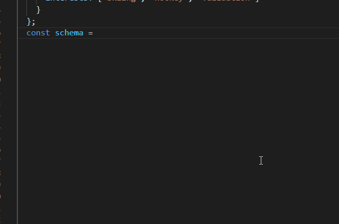

# AJV-types [](https://www.npmjs.com/package/@johnny.reina/ajv-types)

_Schema types and generator functions for AJV_



## Why?

Reading the AJV docs is a massive chore and it can be hard to defined a schema correctly.

## Installation

`npm i @johnny.reina/ajv-types`

## Usage

```typescript
import A from "../src";
const An = A; // Optional but nice to read if that's your thing
              // also you can name these whatever you want

const schema = An.Object({
  additionalProperties: false,
  properties: {
    username: A.String({ minLength: 3 }),
    password: A.String({ minLength: 16 }),
    profile: An.Object({
      additionalProperties: false,
      properties: {
        birthday: A.Format.Email,
        interests: An.Array({
          items: A.String()
        })
      }
    })
  }
});
```

## Using just the types
The types can be used standalone to provide compile-type schema validation. Just import from `@johnny.reina/ajv-types/types`;

```typescript
import { ObjectSchema } from "../src/types";
```

